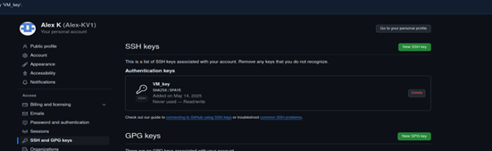
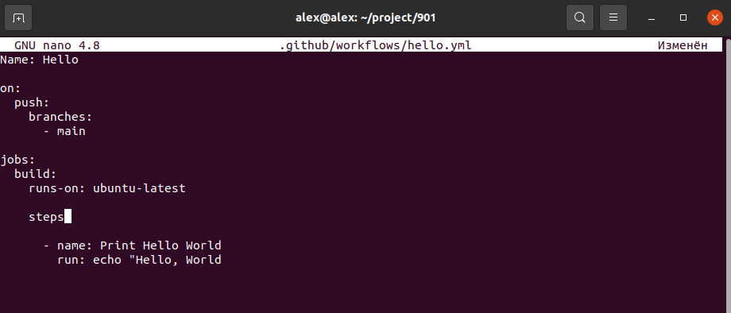

### Регистрация на github <br>

<li> Создан аканут на github
<li> Заполнен профиль основной информацией<br>

<br>
<br>
### Настройка конфигурации GIT
<br>
### Настройка SSH для GitHub
<br>
Добавление shh-ключа для аутентификации<br>
<br>
<br>
>Проверка соединения между локальным компьютером и github с помощью коммнады
```ssh -T git@github.com```<br>

<br>

Клоинрование репозитория на другой пк плюсь редактирование файла **README.md** и заливка обновлений в удаленный репазиторий.<br>
<br>

## Настройка пайплайна на Github-е
<br>
<br>
